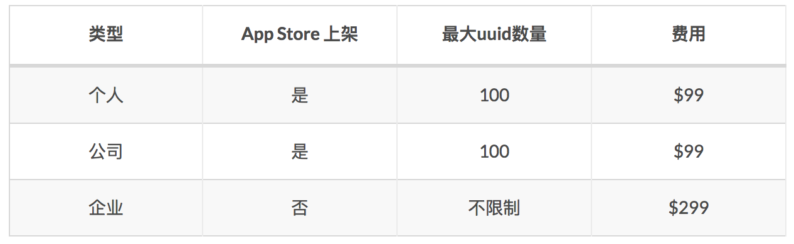

# PublicMethod
#### [其他](README_OTHER.md)
#### 获取Assets.xcassets中的 `LaunchImage`图片
    CGSize viewSize = [UIScreen mainScreen].bounds.size;
    // 竖屏
    NSString *viewOrientation = @"Portrait";
    NSString *launchImageName = nil;
    NSArray* imagesDict = [[[NSBundle mainBundle] infoDictionary] valueForKey:@"UILaunchImages"];
    for (NSDictionary* dict in imagesDict)
    {
    CGSize imageSize = CGSizeFromString(dict[@"UILaunchImageSize"]);
    if (CGSizeEqualToSize(imageSize, viewSize) && [viewOrientation isEqualToString:dict[@"UILaunchImageOrientation"]])
    {
    launchImageName = dict[@"UILaunchImageName"];
    }
    }
    return launchImageName;
    }

#### 获取Assets.xcassets中的 `AppIcon`
    + (UIImage *)getAppIcon {

    NSDictionary *infoPlist = [[NSBundle mainBundle] infoDictionary];
    NSString *icon = [[infoPlist valueForKeyPath:@"CFBundleIcons.CFBundlePrimaryIcon.CFBundleIconFiles"] lastObject];
    UIImage *image = [UIImage imageNamed:icon];
    return image;
    }

#### 判断是否是 iPhoneX
    + (BOOL)xys_isIPhoneX {
    struct utsname systemInfo;
    uname(&systemInfo);
    NSString *platform = [NSString stringWithCString:systemInfo.machine encoding:NSASCIIStringEncoding];
    if ([platform isEqualToString:@"i386"] || [platform isEqualToString:@"x86_64"]) {
    // 模拟器下采用屏幕的高度来判断
    return [UIScreen mainScreen].bounds.size.height == 812;
    }
    BOOL isIPhoneX = [platform isEqualToString:@"iPhone10,3"] || [platform isEqualToString:@"iPhone10,6"];
    return isIPhoneX;
    }

#### 汉字转拼音
    + (NSString *) chineseCharactersToPinyin:(NSString *)sourceString {
    NSMutableString *mutableString = [NSMutableString stringWithString:sourceString];
    CFStringTransform((CFMutableStringRef)mutableString, NULL, kCFStringTransformToLatin, false);
    mutableString = (NSMutableString *)[mutableString stringByFoldingWithOptions:NSDiacriticInsensitiveSearch locale:[NSLocale currentLocale]];
    return mutableString;
    }

#### 获取视频第一帧图片
    + (UIImage*) thumbnailImageForVideo:(NSURL *)videoURL atTime:(NSTimeInterval)time {

    AVURLAsset *asset = [[AVURLAsset alloc] initWithURL:videoURL options:nil];
    NSParameterAssert(asset);
    AVAssetImageGenerator *assetImageGenerator =[[AVAssetImageGenerator alloc] initWithAsset:asset];
    assetImageGenerator.appliesPreferredTrackTransform = YES;
    assetImageGenerator.apertureMode = AVAssetImageGeneratorApertureModeEncodedPixels;

    CGImageRef thumbnailImageRef = NULL;
    CFTimeInterval thumbnailImageTime = time;
    NSError *thumbnailImageGenerationError = nil;
    thumbnailImageRef = [assetImageGenerator copyCGImageAtTime:CMTimeMake(thumbnailImageTime, 6)actualTime:NULL error:&thumbnailImageGenerationError];

    if(!thumbnailImageRef)
    NSLog(@"thumbnailImageGenerationError %@",thumbnailImageGenerationError);

    UIImage*thumbnailImage = thumbnailImageRef ? [[UIImage alloc]initWithCGImage: thumbnailImageRef] : nil;

    return thumbnailImage;
    }

#### 金额格式化
    + (NSString *)stringTwoDecimalPlaces:(NSString *)numString positivePrefix:(NSString *)positivePrefix {

    NSNumberFormatter *formatter = [[NSNumberFormatter alloc]init];
    NSNumber *number = [formatter numberFromString:numString];

    //整数每三位逗号分开
    formatter.numberStyle = kCFNumberFormatterDecimalStyle;
    //小数点后保留两位
    formatter.maximumFractionDigits = 2;
    formatter.minimumFractionDigits = 2;
    //数字前加￥
    formatter.positivePrefix = positivePrefix;

    NSString *string = [formatter stringFromNumber:number];

    return string;
    }

#### 更改iOS状态栏的颜色
    - (void)setStatusBarBackgroundColor:(UIColor *)color
    {
    UIView *statusBar = [[[UIApplication sharedApplication] valueForKey:@"statusBarWindow"] valueForKey:@"statusBar"];

    if ([statusBar respondsToSelector:@selector(setBackgroundColor:)])
    {
    statusBar.backgroundColor = color;
    }
    }

#### 修改状态栏字体颜色
只能设置两种颜色，黑色和白色，系统默认黑色
设置为白色方法：
* 在Info.plist 中设置`Status bar style`,值为`UIStatusBarStyleLightContent`
* 在Info.plist 中添加`View controller-based status bar appearance`,值为`NO`
* 在Info.plist 中设置`Status bar is initially hidden`,值为`NO`

#### 判断view是不是指定视图的子视图
    BOOL isView = [textView isDescendantOfView:self.view];

#### 关于NSDateFormatter的格式
    G: 公元时代，例如AD公元
    yy: 年的后2位
    yyyy: 完整年
    MM: 月，显示为1-12
    MMM: 月，显示为英文月份简写,如 Jan
    MMMM: 月，显示为英文月份全称，如 Janualy
    dd: 日，2位数表示，如02
    d: 日，1-2位显示，如 2
    EEE: 简写星期几，如Sun
    EEEE: 全写星期几，如Sunday
    aa: 上下午，AM/PM
    H: 时，24小时制，0-23
    K：时，12小时制，0-11
    m: 分，1-2位
    mm: 分，2位
    s: 秒，1-2位
    ss: 秒，2位
    S: 毫秒

#### 防止scrollView手势覆盖侧滑手势
    [scrollView.panGestureRecognizerrequireGestureRecognizerToFail:self.navigationController.interactivePopGestureRecognizer];

#### 修改textField的placeholder的字体颜色、大小
    [self.textField setValue:[UIColor redColor] forKeyPath:@"_placeholderLabel.textColor"];
    [self.textField setValue:[UIFont boldSystemFontOfSize:16] forKeyPath:@"_placeholderLabel.font"];

#### 调整UIButton的title和image
    @property(nonatomic) UIEdgeInsets titleEdgeInsets; // default is UIEdgeInsetsZero
    @property(nonatomic) UIEdgeInsets imageEdgeInsets; // default is UIEdgeInsetsZero

     typedef struct UIEdgeInsets {
        CGFloat top, left, bottom, right;  // specify amount to inset (positive) for each of the edges. values can be negative to 'outset'
    } UIEdgeInsets;

###### 它有四个参数：`top` `left` `bottom` `right`表示上左下右的偏移量，其含义为：
        top: 为正数的时候，是往下偏移，为负数的时候往上偏移；
        left: 为正数的时候往右偏移，为负数的时候往左偏移；
        bottom: 为正数的时候往上偏移，为负数的时候往下偏移；
        right:为正数的时候往左偏移，为负数的时候往右偏移
        同向偏移为正，反向偏移为负。

#### `nil` `Nil` `NULL` `NSNull`的区别
* `nil`:指向一个对象的空指针，对objective c id 对象赋空值
* `Nil`:指向一个类的空指针，表示对类进行赋空值
* `NULL`:指向其他类型(如：基本类型、C类型)的空指针，用于对非对象指针赋空值
* `NSNull`: 在集合对象中，表示空值的对象

#### 苹果开发者账号区别

#### pickerview iOS 9 bug
//不加下面两行代码 在 iOS 9 系统中间内容会被遮蔽

    [_ui_datePicker setDatePickerMode:UIDatePickerModeDateAndTime];
    [_ui_datePicker setDatePickerMode:UIDatePickerModeDate];

